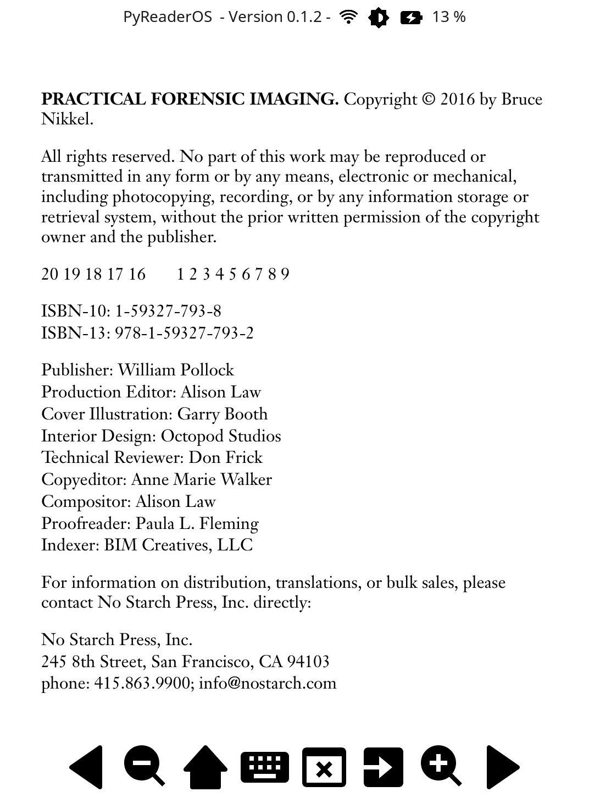

# PyReaderOS

PyReaderOS (name subject to change) is a Window Manager + Python UI + Packages combo built on top of [Postmarket OS](https://wiki.postmarketos.org/wiki/Kobo_Clara_HD_(kobo-clara)) for the Kobo Clara HD.

Some features, including suspend and hardware interactions (leds and screens) work thanks to [Air](https://github.com/bjesus/air) by @bjesus and the Postmarket OS wiki.

---

## Install

## Screenshots

## What works
- [x] Main UI
- [x] Reading books from vraious files formats in Documents
- [x] Manual suspend with random screensavers in Pictures
- [x] WiFi management in settings
- [x] Backlight management with UI
- [x] Simple file browser
- [x] Web browser
- [x] Keyboard
- [x] Custom apps from .desktop files

## Todo

- [ ] Automatic install script on top of PostmarketOS
- [ ] Backup keyboard configuration 
- [ ] Gallery
- [ ] Refocus (win + n) with a UI button
- [ ] Easier change of font size for books
- [ ] Automatic suspend
- [ ] Enhance LED management
- [ ] Other devices compatilibity

## Attribution

Icons are from [boxicons](https://boxicons.com/) Copyright (c) 2015-2021 Aniket Suvarna (MIT License).

---

## License

MIT License

Copyright (c) 2024 Jeremie Amsellem.

Permission is hereby granted, free of charge, to any person obtaining a copy
of this software and associated documentation files (the "Software"), to deal
in the Software without restriction, including without limitation the rights
to use, copy, modify, merge, publish, distribute, sublicense, and/or sell
copies of the Software, and to permit persons to whom the Software is
furnished to do so, subject to the following conditions:

The above copyright notice and this permission notice shall be included in all
copies or substantial portions of the Software.

THE SOFTWARE IS PROVIDED "AS IS", WITHOUT WARRANTY OF ANY KIND, EXPRESS OR
IMPLIED, INCLUDING BUT NOT LIMITED TO THE WARRANTIES OF MERCHANTABILITY,
FITNESS FOR A PARTICULAR PURPOSE AND NONINFRINGEMENT. IN NO EVENT SHALL THE
AUTHORS OR COPYRIGHT HOLDERS BE LIABLE FOR ANY CLAIM, DAMAGES OR OTHER
LIABILITY, WHETHER IN AN ACTION OF CONTRACT, TORT OR OTHERWISE, ARISING FROM,
OUT OF OR IN CONNECTION WITH THE SOFTWARE OR THE USE OR OTHER DEALINGS IN THE
SOFTWARE.
